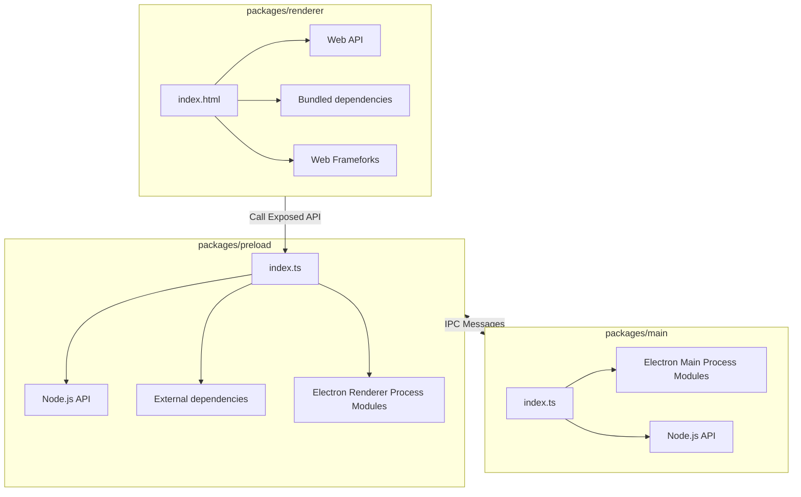

**monaco-editor 不要把编辑器的实例变成响应数据和挂载到模板数据上，会卡死**

[Vite Electron Builder Boilerplate](https://github.com/cawa-93/vite-electron-builder)

### Project Structure

The structure of this template is very similar to the structure of a monorepo.

The entire source code of the project is divided into three modules (packages) that are each bundled independently:

- [`packages/renderer`](packages/renderer). Responsible for the contents of the application window. In fact, it is a
  regular web application. In developer mode, you can even open it in a browser. The development and build process is
  the same as for classic web applications. Access to low-level API electrons or Node.js is done through the _preload_
  layer.
- [`packages/preload`](packages/preload). Acts as an intermediate bridge between the _renderer_ process and the API
  exposed by electron and Node.js. Runs in an _isolated browser context_, but has direct access to the full Node.js
  functionality.
  See [Checklist: Security Recommendations](https://www.electronjs.org/docs/tutorial/security#2-do-not-enable-nodejs-integration-for-remote-content)
  .
- [`packages/main`](packages/main)
  Electron [**main script**](https://www.electronjs.org/docs/tutorial/quick-start#create-the-main-script-file). This is
  the main process that powers the application. It manages creating and handling the spawned BrowserWindow, setting and
  enforcing secure permissions and request handlers. You can also configure it to do much more as per your need, such
  as: logging, reporting statistics and health status among others.

### Build web resources

The `main` and `preload` packages are built in [library mode](https://vitejs.dev/guide/build.html#library-mode) as it is
simple javascript.
The `renderer` package builds as a regular web app.

### Compile App

The next step is to package a ready to distribute Electron app for macOS, Windows and Linux with "auto update" support
out of the box.

To do this, use [electron-builder]:

- Using the npm script `compile`: This script is configured to compile the application as quickly as possible. It is not
  ready for distribution, it is compiled only for the current platform and is used for debugging.
- Using GitHub Actions: The application is compiled for any platform and ready-to-distribute files are automatically
  added as a draft to the GitHub releases page.
